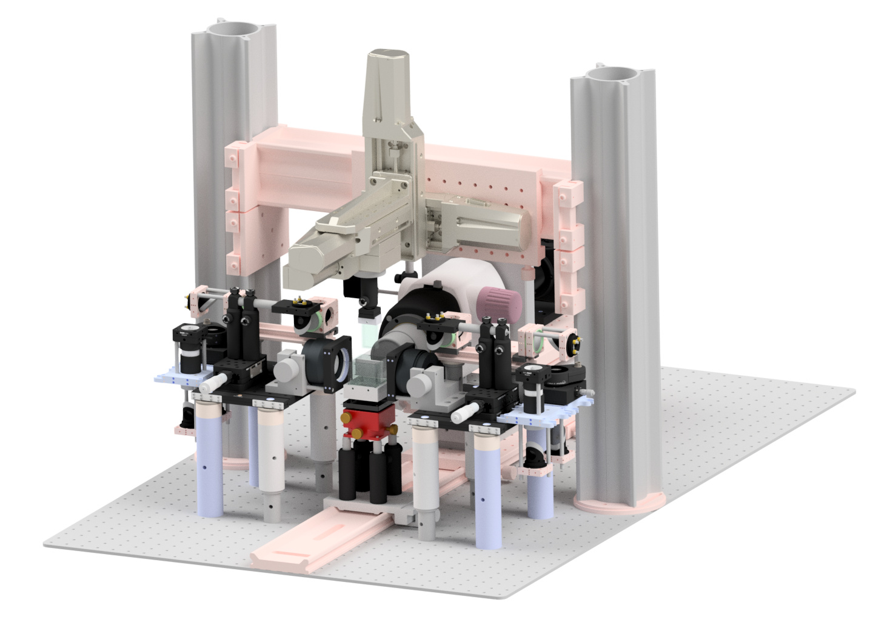

## What is the mesoSPIM project?
The mesoSPIM (mesoscale selective plane illumination microscopy) project
aims at creating open-hardware microscopy platforms for imaging in cleared tissue. Core features of the mesoSPIM setups are:

* compatibilty with all tissue clearing techniques
* large field-of-views
* dual-sided excitation
* optimized for fast screening of whole mouse brain samples (10-14 GB/brain/color at low magnification, up to 100 GB/brain/color at high magnification)
* near-isotropic sampling (1.5-5 µm in X,Y and 3-6 µm in Z) due to an axially swept lightsheet which leads to uniform z-resolution across the field-of-view
* modular sample holders and quick sample exchange
* large travel range (50 x 50 x 100 mm) to allow imaging of very large samples

## Benchtop mesoSPIM
The [Benchtop mesoSPIM](https://github.com/mesoSPIM/benchtop-hardware) is the newest version and its repository is separate to organize documentation and wiki pages of the two very different systems.

## "Mainframe" mesoSPIM
The [mesoSPIM v.5 wiki](https://github.com/mesoSPIM/mesoSPIM-hardware-documentation/wiki) provides documentation, setup, and usage instructions of "mainframe" mesoSPIMs that require an optical table.

## mesoSPIM Version 6 "Revolver"
The detection arm of older versions (4 and 5) can be upgraded to a v.6 "Revolver" using the [following documentation](https://github.com/mesoSPIM/benchtop-hardware/tree/main/v4-5-upgrade-2023).

## mesoSPIM v.5

## Who is the mesoSPIM project for?
* You are looking for a versatile imaging platform for cleared tissue that can be tailored to your needs.
* Research groups and imaging facilities with experience in building and supporting custom microscopes.

## What are ideal imaging applications for a mesoSPIM?
* screening of large numbers of samples for clearing & labeling quality
* visualization of cell populations or other structures (blood vessels, plaques) in whole cleared organs

## What are the mesoSPIM instruments less well suited for?
* imaging live samples (this is the domain of classical light-sheet microscopes)
* high-resolution imaging (<1.5 µm optical resolution), e.g. subcellular structures.

## Not sure where to start?
You can start by comparing [Benchtop and V5](https://github.com/mesoSPIM/benchtop-hardware/tree/main) versions and deciding which one suites your needs better. When ready, review the respective Wiki pages and parts list. If still in doubt, contact us for help.

## About
See the project history and meet the developers on our [main website](https://mesospim.org/about/).
